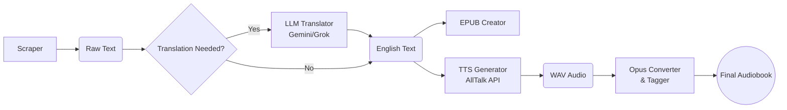

Here is a professional, high-impact `README.md` for your project. It is structured to appeal to both users (clear instructions) and recruiters (highlighting architecture, skills, and modularity).

Save this as `README.md` in your project root.

---

# Auto-Audiobook Pipeline

> **An automated pipeline to scrape web novels, translate them (via LLMs), and convert them into high-quality audiobooks with AI-generated narration.**

## Overview

This project is a modular automation suite designed to turn any web novel into a polished audiobook. It handles every step of the process: scraping raw text, translating foreign content (Chinese  English) using context-aware AI (Gemini/Grok), generating TTS audio (AllTalk/XTTS), and packaging everything into standard formats (`.epub`, `.opus`).

It features a **modern GUI** to manage multiple novel projects simultaneously and includes a unique **Scraper Adapter Tool** that uses AI to write new scrapers for unsupported websites automatically.

---

## Key Features

* **GUI Controller:** A user-friendly `tkinter` interface to manage projects, toggle pipeline steps, and monitor logs.
* **Multi-Site Scraping:** Includes an AI-assisted tool to generate custom scraper scripts for any new website URL.
* **Context-Aware Translation:** Uses **Google Gemini** or **xAI Grok** with a dynamic glossary system to maintain consistent character names and terminology across thousands of chapters.
* **Smart TTS Generation:**
* Integrates with **AllTalk (XTTS)** for high-quality, emotive AI voices.
* Features a "Cascading Fallback" system (Paragraph  Sentence  Forced Split) to handle long text chunks without crashing.


* **Audio Optimization:** Automatically converts large WAV files to efficient Opus format and tags them with cover art and metadata.
* **E-Book Creation:** Compiles scraped text into a properly formatted `.epub` for reading apps.

---

## Architecture

The system operates on a modular pipeline architecture where each script functions independently but shares a common project structure managed by the GUI.



---

## Installation

### Prerequisites

* **Python 3.9+**
* **FFmpeg** (Required for audio conversion)
* **AllTalk TTS** (Running locally or on a server)

### 1. Clone the Repository

```bash
git clone https://github.com/yourusername/auto-audiobook-pipeline.git
cd auto-audiobook-pipeline

```

### 2. Install Dependencies

This project uses Conda to manage dependencies.

```bash
# Create the environment
conda env create -f environment.yml

# Activate the environment
conda activate web_scraper_env
```

### 3. Environment Setup

You need API keys for the translation engines. Set them in your environment variables:

* **Windows (PowerShell):**
```powershell
$env:GEMINI_API_KEY="your_gemini_key"
$env:XAI_API_KEY="your_grok_key"

```


* **Linux/Mac:**
```bash
export GEMINI_API_KEY="your_gemini_key"
export XAI_API_KEY="your_grok_key"

```


---

## Usage

### 1. Launch the GUI

Run the main controller script:

```bash
python pipe_system_gui.py

```

### 2. Create a Project

1. Click **"New Project"** in the top bar.
2. Enter a name (e.g., `My_New_Novel`).
3. The system will automatically create the folder structure in `/Novels/My_New_Novel`.

### 3. Run the Pipeline

* **Scraping:** If you have a supported scraper, check "Run Scraper".
* **Translation:** Select "Translate (Gemini)" or "Grok" if the source is in Chinese.
* **Audio:** Check "Generate TTS" and "Convert to Opus" for the final audio files.
* Click **START PROCESSING**.

### 4. Adapting to New Websites

1. Go to the **"Adapt Scraper"** tab in the GUI.
2. Paste the URL of the new novel you want to scrape.
3. Click **Fetch Context**.
4. The tool will save the website's HTML and the reference scraper into the project folder.
5. **Action:** Upload these files to an AI (like Gemini) and ask it to "Update the reference scraper to work with this HTML."

---

## File Structure

The project uses a clean, project-based hierarchy managed automatically by the software.

```text
/AudioBook_Pipeline/
├── pipe_system_gui.py          # Main Application Entry Point
├── scraper_context_fetcher.py  # AI Helper for new sites
├── scraper_2.py                # Core Scraper Logic
├── gemini_transelate_4.py      # LLM Translation Logic
├── alltalk_tts_generator...py  # TTS Interface
├── /Novels/                    # Project Data Storage
│   ├── /Mistaken_Fairy/
│   │   ├── /01_Raw_Text/       # Scraped .txt files
│   │   ├── /02_Translated/     # English .txt files
│   │   ├── /03_Audio_WAV/      # Raw TTS Output
│   │   ├── /04_Audio_Opus/     # Final Compressed Audio
│   │   ├── chapters.json       # Metadata & Order
│   │   └── Novel.epub          # E-Book file

```

---

## Technical Highlights

* **Robust Error Handling:** The TTS script includes a **3-stage fallback mechanism** (Line  Sentence  Forced Character Split) to ensure audio generation never fails on long, complex sentences.
* **Context Optimization:** The translation modules dynamically filter the glossary JSON, sending only *relevant* characters to the LLM to save token costs and improve accuracy.
* **Asynchronous-like Design:** The GUI uses threading to run heavy IO/Network operations (scraping, downloading audio) without freezing the interface.
* **Maintainability:** Hardcoded paths were replaced with `os.getenv` injection, decoupling the logic from the file system and making the code portable.

---

## Contributing

Contributions are welcome! Please fork the repository and submit a pull request for any features or bug fixes.

