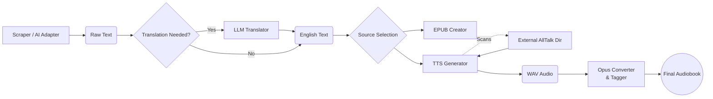

# Auto-Audiobook Pipeline

> **An automated pipeline to turn web novels into high-quality audiobooks with AI narration, translation, and metadata embedding.**

## Overview

This modular automation suite handles every step of creating an audiobook from a web novel. It manages the complex workflow of scraping text, translating foreign content (via Gemini/Grok), generating emotive AI speech (via AllTalk/XTTS), and packaging everything into standard formats (`.epub`, `.opus`).

It features a **modern GUI** to manage multiple novel projects and includes a powerful **AI Adapter Tool** that can write custom scrapers for unsupported websites on the fly.

---

## Key Features

* **GUI Controller:** A user-friendly interface to manage projects, toggle pipeline steps, and monitor logs in real-time.
* **AI Scraper Adapter:** Feed a URL to the built-in AI tool, and it will **write a custom Python scraper** for that specific website automatically.
* **Metadata Auto-Fetch:** Automatically extracts book covers, titles, and authors from index pages (with AI failover).
* **Context-Aware Translation:** Uses LLMs (Gemini/Grok) with a dynamic glossary system to maintain consistent character names across thousands of chapters.
* **Smart TTS Generation:**
    * **External Integration:** Point the GUI to your existing AllTalk installation to automatically scan for available voices (`.wav`) and RVC models (`.pth`).
    * **RVC Support:** Seamlessly apply RVC (Retrieval-based Voice Conversion) models to the XTTS output for distinct character voices.
    * **Cascading Fallback:** Uses a robust text splitting system (Line -> Sentence -> Forced Split) to prevent generation crashes on long paragraphs.
* **Audio Optimization:** Converts WAV files to efficient Opus format and embeds cover art + metadata.
* **E-Book Creation:** Compiles text into a properly formatted `.epub`.

---

## Architecture



---

## Installation

### 1. Prerequisites

* **Python 3.10+**
* **FFmpeg** (Required for audio conversion).
* **AllTalk TTS** (The voice engine backend).

### 2. Setting up AllTalk (TTS Backend)

This project requires a running instance of **AllTalk TTS** to generate audio.

1. Download the **Beta Version** of AllTalk from here: [erew123/alltalk_tts (alltalkbeta)](https://github.com/erew123/alltalk_tts/tree/alltalkbeta)
2. Follow their installation guide.
3. Start the server using `start_alltalk.bat` (Windows) or `./start_alltalk.sh` (Linux).
4. Ensure it is running on `http://127.0.0.1:7851`.

### 3. Setting up This Pipeline

1. **Clone the Repository:**

```bash
git clone git@github.com:erlint1212/audiobook_creator.git
cd audiobook_creator

```

2. **Install Dependencies:**
I recommend using Conda:

```bash
conda env create -f environment.yml
conda activate web_scraper_env

```

3. **Environment Variables:**
Set your API keys for the translation/AI coding features:

* **Windows (PowerShell):**

```powershell
$env:GEMINI_API_KEY="your_gemini_key"
$env:XAI_API_KEY="your_grok_key"

```

* **Linux/Mac:**

```bash
export GEMINI_API_KEY="your_gemini_key"
export XAI_API_KEY="your_grok_key"

```

---

## Usage

### 1. Launch the GUI

Run the main controller:

```bash
python pipe_system_gui.py

```

### 2. Create a Project

1. Click **"New"** in the top bar.
2. Enter a name (e.g., `My_Novel`).
3. The system creates the folder structure in `/Novels/My_Novel`.

### 3. Fetch Metadata (Optional)

1. Paste the **Index Page URL** of the novel in the top bar.
2. Click **"Get Meta"**.
3. The system will download the **Cover Image** and create a `metadata.json` file.

* *Note: If the default fetch fails, it will automatically ask Gemini to write a custom metadata script for that site.*

### 4. Scrape Chapters

* **Supported Site:** Just click "Run Scraper".
* **New Site:** Go to the **"AI Adapter"** tab.

1. Paste the URL of **Chapter 1**.
2. Select "Chapter Scraper".
3. Click **"Ask Gemini to Write Script"**.
4. Once finished, the GUI will automatically use this new custom scraper.

### 5. Configure TTS (Important)

Before running the TTS step, you must link your AllTalk installation:

1. Under the **External AllTalk TTS Setup** section, click **Browse**.
2. Select your main AllTalk folder (e.g., `C:/Users/name/Documents/tts/alltalk_tts`).
3. Click **Scan Voices**.
4. Select your desired **XTTS Voice** (`.wav` reference) and optional **RVC Model** from the dropdowns.

### 6. Run the Pipeline

1. Select your **Source Content**:

* **Raw:** Use the text directly from the scraper.
* **Translated:** Use text from the translation folder.

2. Check the steps you want to run (e.g., TTS, Convert, Tag).
3. Click **START PROCESSING**.

---

## File Structure

The system manages files automatically:

```text
/Novels/
    ├── /My_Novel/
    │   ├── /01_Raw_Text/       # Scraped .txt files
    │   ├── /02_Translated/     # Translated .txt files
    │   ├── /03_Audio_WAV/      # Raw TTS Output
    │   ├── /04_Audio_Opus/     # Final Tagged Audio
    │   ├── cover.jpg           # Book Cover
    │   ├── metadata.json       # Book Info
    │   ├── custom_scraper.py   # AI-Generated Scraper
    │   └── My_Novel.epub       # Generated E-Book

```

---

## Technical Highlights

* **Sanitized Path Handling:** The system automatically cleans file paths to ensure compatibility with the AllTalk API, preventing common "File Not Found" errors when running across different drives.
* **Self-Healing Scrapers:** The AI Adapter analyzes HTML structure to generate Python code, allowing you to scrape virtually any novel site without writing code yourself.
* **Dynamic Glossary:** The translation module extracts names/places and builds a glossary JSON, ensuring "Li Huo" doesn't become "Raging Fire" halfway through the book.
* **Audio Tagging:** The final Opus files are tagged with **Chapter Titles** (read from the text), **Album Art**, and **Track Numbers** automatically.

---

## Contributing

Contributions are welcome! Please fork the repository and submit a pull request.

